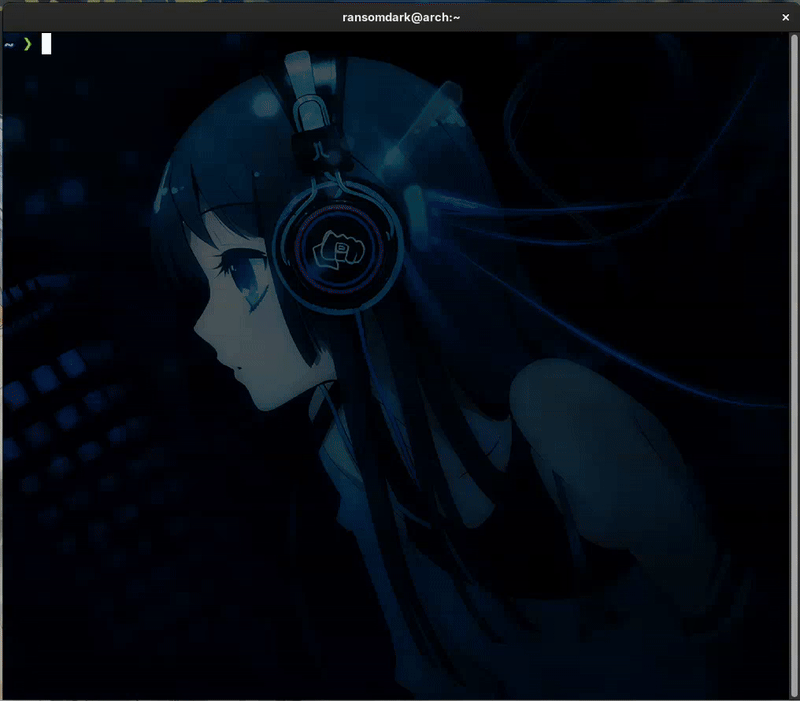

# GoL - Game Of Life



- $${\color{Green}\\#}$$ - Сell generation 1
- $${\color{Yellow}\\#}$$ - Сell generation 2
- $${\color{Orange}\\#}$$ - Сell generation 3
- $${\color{Red}\\#}$$ - Cell generation >3

## Configuration
You can  
- Change Speed. Edit `INITIAL_DELAY` in `game_of_life.h`  
- Switch Presets. Modify `PRESET_PATH` in `game_of_life.h`. Several presets available in `presets/` folder  
> [!NOTE]
> More patterns can be found [here](https://www.samcodes.co.uk/project/game-of-life/). You need to copy `Patten File` and paste to `presets/<your_pattern>.txt`, then redact `PRESET_PATH` in `game_of_life.h`

> [!WARNING]
> After editing files a rebuild is required

## Install
```sh
sudo make
sudo make install
```

## Uninstall
``` sh
sudo make clean
sudo make uninstall
```

## Rebuild
```sh
sudo make rebuild
```
